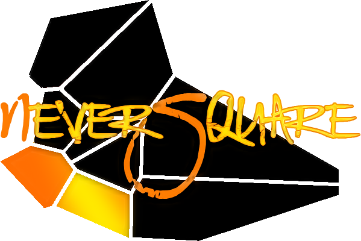
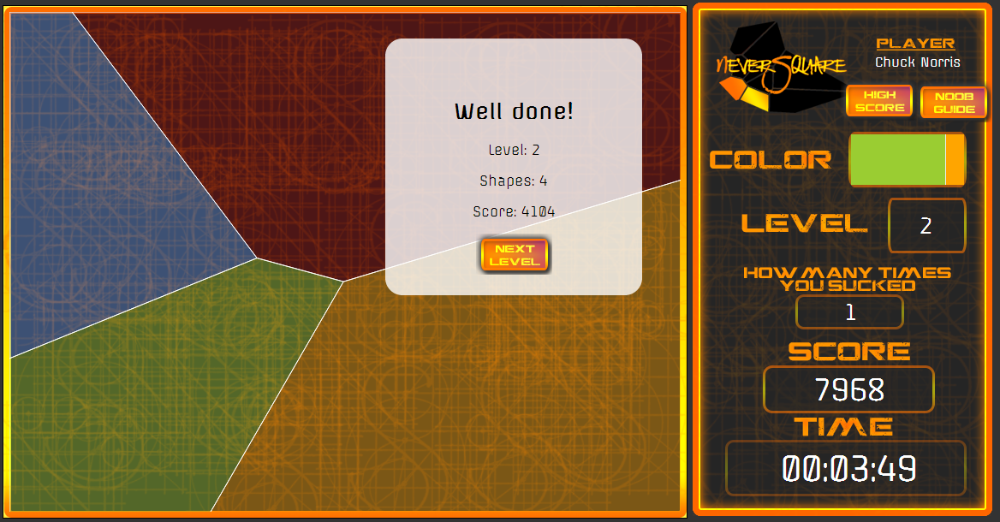
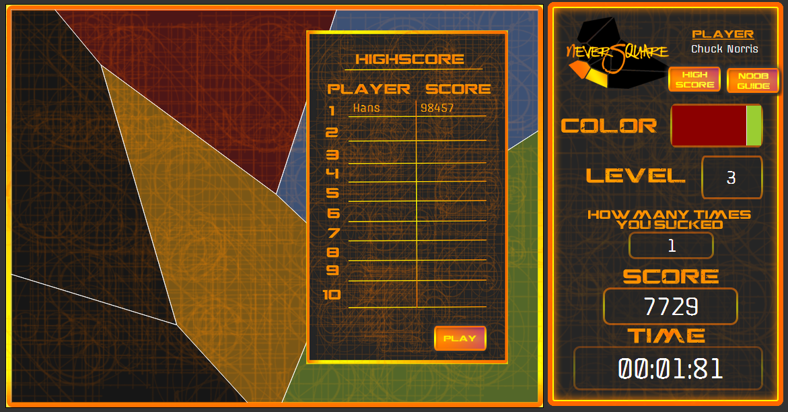

# NeverSquare by Darkside

## Project

This game was create in the Sonen Game Jam (http://sonengamejam.org).
The challenge was to create a game in 24 hours.

Source code: http://github.com/Xennis/NeverSquare

### Used software

JavaScript libaries
* [jQuery](http://jquery.com) JavaScript library (v.2.0.3)
    * [jquery.timer.js](http://github.com/jchavannes/jquery-timer) jQuery plugin
* [Raphaël](http://raphaeljs.com/) JavaScript vector library (v.2.1.2)
* [Moment.js](http://momentjs.com/) JavaScript date library (v.2.2.1)  
* [rhill-voronoi-core.js](http://github.com/gorhill/Javascript-Voronoi) Voronoi JavaScript class

### Demo and screenshots

**Demo**: http://xennis.github.io/NeverSquare/

